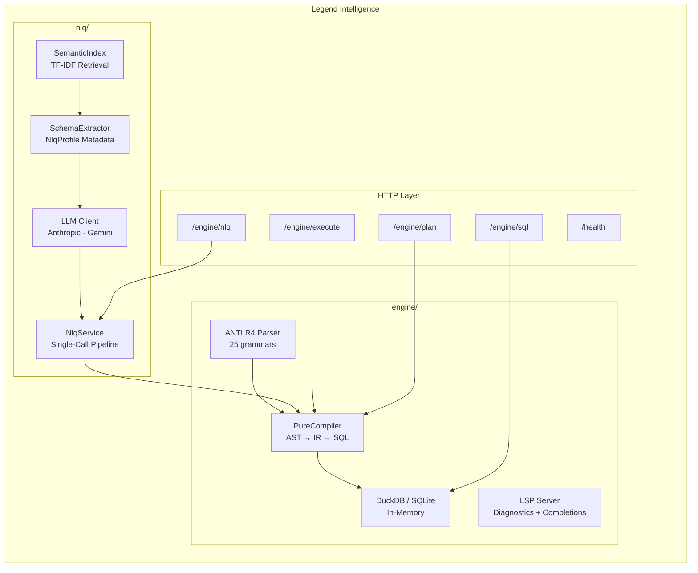
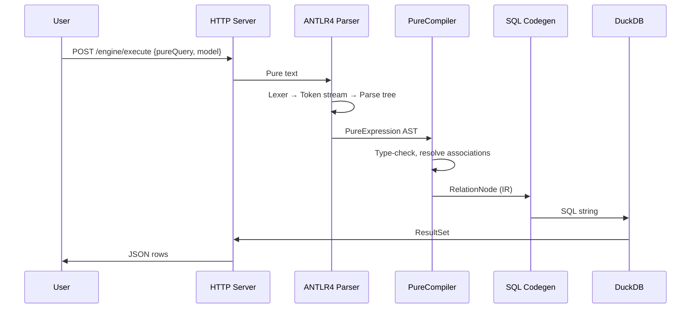
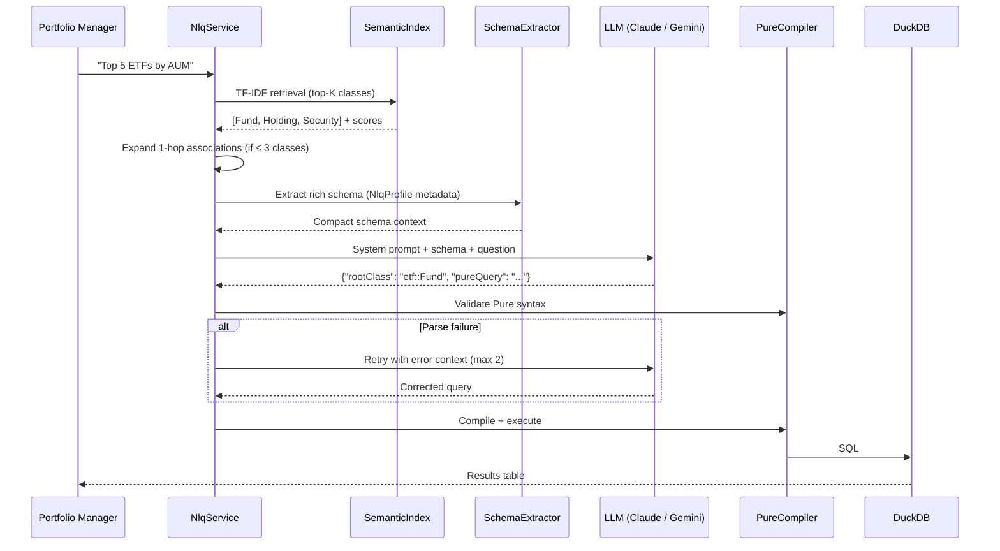

# Legend Intelligence

### A Pure-language compiler and NLQ engine that turns English into instant SQL answers — so the PM gets data in seconds, not days.

Legend Intelligence is a ground-up implementation of the [FINOS Legend](https://legend.finos.org/) Pure language engine paired with a Natural Language Query pipeline. Write strongly-typed Pure queries or ask in plain English — every query compiles 100% to SQL, and no data ever leaves the database into the JVM. One fat JAR, backed by DuckDB in-memory, for instant zero-infra execution.

> **1,100+ tests · 24 aggregate functions · 28 expression types · 25 ANTLR grammars · 3 LLM providers**

---

## What Problem Does This Solve?

| Today | With Legend Intelligence |
|-------|------------------------|
| PM asks "What's AAPL's total weight across all ETFs?" — analyst writes SQL, tests, ships | PM types the question → gets a table in seconds |
| Pure queries require a full Legend Engine deployment (150+ JARs, Postgres, metadata store) | Single fat JAR, in-memory DuckDB, `java -jar` and done |
| Schema changes break downstream queries silently | Strongly-typed Pure model catches errors at compile time |
| LLM-generated SQL hallucinates tables and columns | SemanticIndex retrieves real schema → LLM generates Pure → compiler validates before execution |
| Analysts context-switch between Pure, SQL, and Python | One language (Pure) compiles to SQL; NLQ bridges from English |
| Testing NLQ accuracy means eyeballing answers | Built-in eval framework scores retrieval recall, precision, ops coverage, and answer accuracy |

---

## Architecture



---

## Compile Pipeline



---

## NLQ Pipeline



---

## Key Concepts

### :gear: The Pure Language

Pure is a strongly-typed functional language for data modeling and querying. Schema-as-code means your classes, associations, and constraints are the single source of truth — not a wiki page that drifts from production.

```pure
Class <<nlq::NlqProfile.core>>
      {nlq::NlqProfile.description = 'An investment fund (ETF or mutual fund)',
       nlq::NlqProfile.synonyms = 'fund, etf, mutual fund, ticker',
       nlq::NlqProfile.sampleValues = 'ticker: SPY, QQQ, VTI',
       nlq::NlqProfile.unit = 'aum: USD millions',
       nlq::NlqProfile.exampleQuestions = 'Top 5 ETFs by AUM?'} etf::Fund
{
  ticker     : String[1];
  fundName   : String[1];
  aum        : Float[1];     // Assets Under Management, USD millions
  assetClass : String[1];    // EQUITY, FIXED_INCOME, COMMODITY
}
```

### :brain: SemanticIndex — TF-IDF Retrieval

The SemanticIndex turns your Pure model into a searchable corpus. Each class becomes a document weighted by four scoring dimensions:

| Dimension | Weight | What It Scores |
|-----------|--------|----------------|
| Description + Synonyms | 40% | TF-IDF cosine similarity on NlqProfile text |
| Property Names | 30% | TF-IDF on property names + camelCase splits |
| Example Questions | 20% | Exact match against `exampleQuestions` annotations |
| Importance Boost | 10% | `core` > `junction` > `timeseries` class stereotypes |

Pre-tokenizes with 394 stop words, camelCase splitting, and abbreviation expansion (P&L, FX, OTC, YTD, MTD). Returns top-K classes above a 10% floor of the max score.

### :zap: 100% SQL Pushdown

Legend Intelligence treats the **database as the runtime**. Every Pure operation — `filter`, `groupBy`, `join`, `asOfJoin`, window functions — compiles to a SQL query that DuckDB executes natively. Zero rows are materialized in Java. This means:

- **No ORM overhead** — no N+1 queries, no lazy-loading surprises
- **Predictable performance** — the query plan is the execution plan
- **Database-native optimization** — DuckDB's columnar engine handles aggregations, joins, and window functions at full speed

### :satellite: NlqProfile Annotations

NlqProfile annotations are how you **ground LLMs in your schema**. Instead of hoping the model guesses your column semantics, you declare them:

| Annotation | Purpose | Example |
|------------|---------|---------|
| `description` | What this class/property represents | `'Assets Under Management in USD millions'` |
| `synonyms` | Alternative names users might say | `'fund, etf, mutual fund, ticker'` |
| `sampleValues` | Real values for few-shot grounding | `'ticker: SPY, QQQ, VTI'` |
| `unit` | Units and scale | `'aum: USD millions'` |
| `exampleQuestions` | Questions this class can answer | `'Top 5 ETFs by AUM?'` |
| `businessDomain` | Domain classification | `'ETF Analytics'` |
| `importance` | Retrieval priority | `'high'` / `'medium'` / `'low'` |
| `whenToUse` | When to include in query context | `'Use for line-item fund→security detail'` |

### :wrench: LSP Server

The built-in Language Server Protocol server provides real-time IDE support:

- **Diagnostics** — syntax errors, type mismatches, unresolved references
- **Completions** — class names, property names, function signatures
- **Hover** — type information and documentation on hover

Endpoint: `POST /lsp` — accepts standard LSP JSON-RPC messages.

---

## Quick Start

**Requirements:** Java 21, Maven 3.8+

```bash
# 1. Build the fat JAR (skip tests for speed)
JAVA_HOME=/opt/homebrew/opt/openjdk@21 mvn install -DskipTests

# 2. Configure your LLM provider
cp .env.example .env
# Edit .env → set LLM_PROVIDER and API keys

# 3. Start the server
./start-nlq.sh > /tmp/legend-server.log 2>&1 &

# 4. Health check
curl http://localhost:8080/health
# → {"status":"ok"}

# 5. Run an NLQ query
curl -X POST http://localhost:8080/engine/nlq \
  -H 'Content-Type: application/json' \
  -d '{
    "code": "...your Pure model...",
    "question": "What are the top 5 ETFs by AUM?",
    "domain": "ETF",
    "model": "claude-haiku-4-5"
  }'
```

---

## HTTP API Reference

| Method | Path | Description |
|--------|------|-------------|
| `POST` | `/engine/execute` | Compile + execute a Pure query against DuckDB → JSON rows |
| `POST` | `/engine/plan` | Compile Pure → SQL only (no execution) |
| `POST` | `/engine/sql` | Execute raw SQL directly against the database |
| `POST` | `/engine/nlq` | English → Pure → SQL → results (full NLQ pipeline) |
| `POST` | `/lsp` | LSP protocol — diagnostics, completions, hover |
| `GET`  | `/health` | Health check → `{"status":"ok"}` |

---

## Supported Pure Operations

| Category | Operations |
|----------|-----------|
| **Tabular** | `project`, `filter`, `extend`, `sort`, `limit`, `take`, `drop`, `slice`, `first`, `distinct` |
| **Aggregation** | `groupBy` with `sum`, `count`, `avg`, `min`, `max`, `count_distinct`, `stddev`, `variance`, `median`, `mode`, `percentile_cont`, `percentile_disc`, `string_agg` |
| **Joins** | `join` (INNER, LEFT), navigation joins (1-hop, multi-hop, filter-through-association), `asOfJoin` |
| **Window** | `rank`, `denseRank`, `lag`, `lead`, `rowNumber`, `ntile`, `percentRank`, `cumulativeDistribution`, running `sum` |
| **Bivariate** | `corr`, `covar_samp`, `covar_pop`, `wavg`, `arg_max`, `arg_min` |
| **Column Ops** | `rename`, `select`, `concatenate` (UNION ALL), TDS literals |

---

## LLM Provider Matrix

| Provider | Env Value | Auth | Notes |
|----------|-----------|------|-------|
| **Anthropic CLI** | `anthropic-cli` | Claude Pro/Max subscription | `claude -p` subprocess — no API key needed |
| **Anthropic API** | `anthropic-api` | `ANTHROPIC_API_KEY` | REST API — all Claude models |
| **Google Gemini** | `gemini` | `GEMINI_API_KEY` | Gemini API |

---

## Why This Matters for S&T

**Quants** — Write Pure queries that compile to SQL without touching infrastructure. Focus on the analytics, not the plumbing. Test with 1,100+ assertions that your compiler does what you expect.

**Data Engineers** — A single fat JAR replaces a multi-service Legend deployment. DuckDB in-memory means no database to provision. The ANTLR grammar is the contract — if it parses, it compiles.

**Desk Strategists** — Ask "Which EQUITY ETFs have expense ratio below 10 bps?" in English. The NLQ pipeline retrieves relevant schema, generates a validated Pure query, and returns results. No SQL, no Jupyter notebook, no analyst in the loop.

**Risk** — The SemanticIndex ensures LLM-generated queries only reference real tables and columns. Pure's type system catches schema drift at compile time. Every query is auditable: English → Pure → SQL → results.

---

## Testing and Quality

| Metric | Value |
|--------|-------|
| Engine unit tests | 1,100+ |
| Pure Compatibility Tests (PCT) | Validates against FINOS Legend spec |
| NLQ eval — cheatsheet (54 cases) | Recall 100%, Pass 98.1% |
| NLQ eval — holdout (25 cases) | Recall 92%, Pass 88% |
| ANTLR grammars | 25 files |
| Expression types | 28 (sealed interface) |
| Aggregate functions | 24 (single + bivariate) |

```bash
# Engine unit tests
mvn test -pl engine

# Pure Compatibility Tests
mvn test -pl pct

# NLQ evaluation suite (requires API key)
mvn test -pl nlq -Dtest="NlqFullPipelineEvalTest" -DGEMINI_API_KEY=...
```

---

## Module Map

```
legend-intelligence/
├── engine/                          # Pure compiler + SQL execution
│   ├── src/main/antlr4/            # 25 ANTLR4 grammars (PureParser.g4: 1,196 lines)
│   ├── src/main/java/
│   │   ├── org/finos/legend/engine/
│   │   │   ├── plan/               # Expression AST, RelationNode IR (66 classes)
│   │   │   ├── sql/                # SQL code generation
│   │   │   ├── server/             # HTTP server, LSP protocol
│   │   │   ├── store/              # DuckDB / SQLite execution
│   │   │   └── transpiler/         # JSON serialization
│   │   └── org/finos/legend/pure/
│   │       ├── dsl/                # PureCompiler, PureParser, function specs
│   │       │   ├── antlr/          # ANTLR AST bridge
│   │       │   ├── ast/            # Abstract syntax tree nodes
│   │       │   ├── definition/     # Model builders (classes, mappings)
│   │       │   └── m2m/            # Mapping-to-mapping compilation
│   │       └── m3/                 # Pure metamodel (M3 core)
│   └── src/test/                   # 1,100+ unit tests
├── nlq/                             # Natural Language Query pipeline
│   └── src/main/java/
│       └── org/finos/legend/engine/nlq/
│           ├── SemanticIndex.java   # TF-IDF retrieval (435 lines)
│           ├── NlqService.java      # Single-call pipeline (265 lines)
│           ├── NlqHttpServer.java   # HTTP endpoint (213 lines)
│           ├── ModelSchemaExtractor.java  # Schema → compact context
│           ├── AnthropicApiClient.java
│           ├── AnthropicCliClient.java
│           ├── GeminiClient.java
│           └── LlmClientFactory.java
├── pct/                             # Pure Compatibility Tests
├── pom.xml                          # Root Maven build
├── start-nlq.sh                     # Server launcher
└── .env.example                     # LLM provider config template
```

---

## Dependencies

| Dependency | Version | Purpose |
|------------|---------|---------|
| DuckDB | 1.4.4 | In-memory columnar SQL execution |
| SQLite | 3.47.1 | Lightweight alternative SQL backend |
| ANTLR4 | 4.13.1 | Parser generator for Pure grammar |
| JUnit 5 | 5.x | Test framework |
| Java | 21 | Runtime (virtual threads, sealed classes) |

Packaged as a **single shaded fat JAR** — no external server, no Postgres, no metadata store.

---

## Related

- [legend-groundzero](https://github.com/absnarang/legend-groundzero) — Interactive Streamlit workbench: Pure editor, NLQ demo, cheat sheet, eval framework
